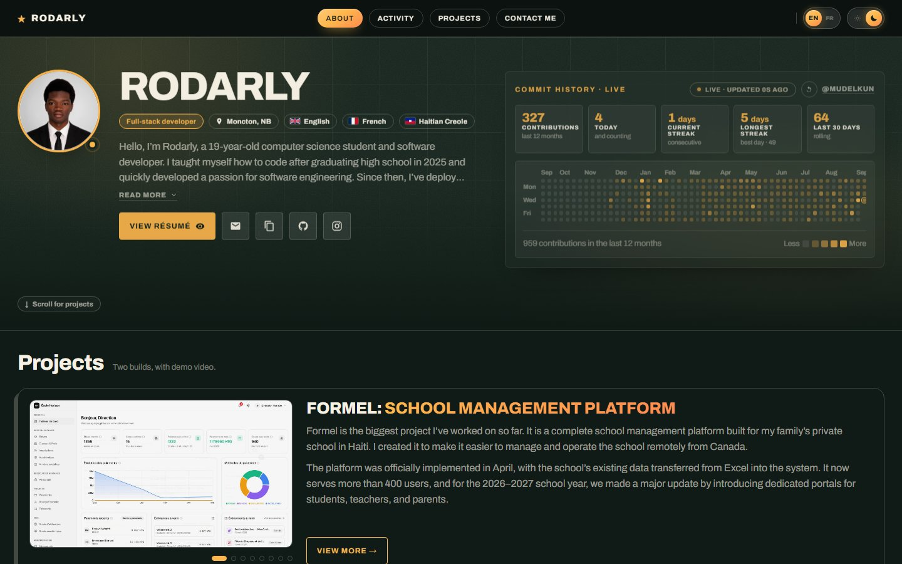
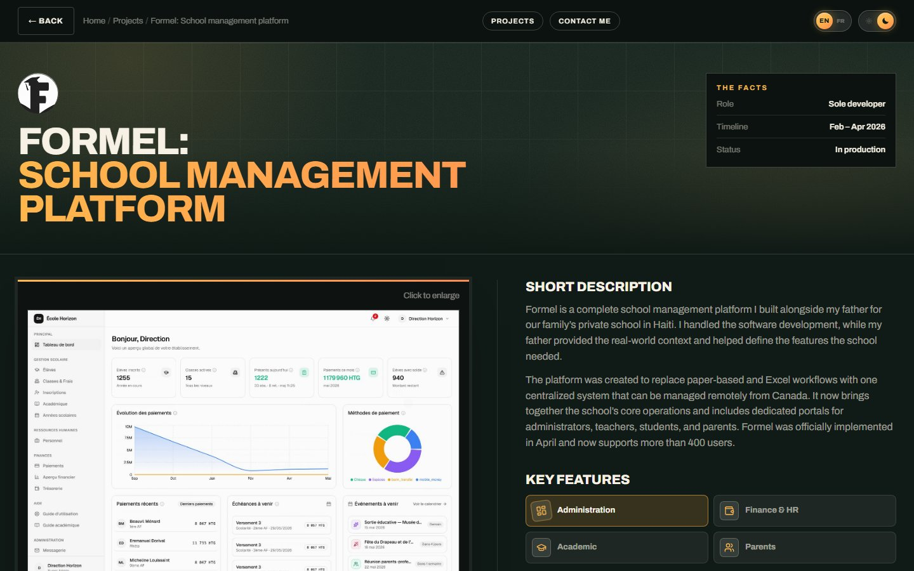

# rodarly.me

My personal portfolio: who I am, what I've built, and how to reach me.

A hand-written site in plain HTML, CSS and JavaScript. No framework and no build step. The pages have no dependencies;
a small Node server hosts them and answers the chat.



## Features

- **Live GitHub activity.** A contribution graph, streaks and a public event feed that refresh on their own while the page is open.
- **One page per project.** Each project has its own address (`/formel`, `/louvo`) with a write-up, grouped features,
  stack logos, a screenshot lightbox and a table of contents that follows your scroll.
- **Per-project branding.** A project page and its card can use that product's own colours and fonts.
- **English / French switch.** The live page is translated in place, so there is no second copy of the text to keep in sync.
- **Ask my AI.** A glowing prompt bar in the hero (plus the contact section and every project page) opens a chat where
  Claude answers questions about me, using only what's written in [`profile.md`](profile.md).
  If something isn't in there, it says so. Per-visitor and daily limits keep the cost bounded, and every question
  is saved to a private Postgres log.
- **Built with care for every visitor.** Dark and light themes, a mobile layout with a pull-up chat sheet and a sticky action bar,
  and animations that switch off when the visitor prefers reduced motion.



## Projects featured

| Project | What it is | Links |
| --- | --- | --- |
| **Formel** | A school management platform running my family's private school in Haiti, used by more than 400 people | Private codebase |
| **Louvo** | An AI hairstyle try-on: upload a selfie and see yourself with any haircut | [louvo.app](https://www.louvo.app) · [source](https://github.com/Mudelkun/Louvo) |

## Run it locally

```sh
npm install
npm run dev
# then open http://localhost:8000
```

For AI answers in the chat, put `ANTHROPIC_API_KEY=...` in a `.env` file (it's git-ignored). Without one, the chat
uses keyword answers. Any static file server also works for the pages alone, such as `python -m http.server 8000`.

## How it's organized

```
server.mjs              serves the site and answers the chat at POST /api/chat
profile.md              everything the chat knows about me (never served)
index.html              home page: hero, live activity, project cards, contact
project.html            template for the project pages
formel.html, louvo.html generated from project.html by tools/build-pages.js
assets/js/data.js       all of the site's content: profile, projects, settings
assets/js/ui.js         theme, mobile nav, binds data.js into the page
assets/js/github.js     live contribution graph, stats and event feed
assets/js/project.js    renders a project page: sections, lightbox, scrollspy
assets/js/brand.js      per-project colours, fonts and motion
assets/js/i18n.js       the EN/FR switch
assets/js/chat.js       "Ask my AI": prompt bars, the chat panel and its floating launcher
assets/css/             base tokens and theme, then one stylesheet per area
assets/media/           portrait, résumé, logos and screenshots
tools/                  build-pages.js and warm-i18n.js; resume.html is the résumé's source,
                        build-resume.mjs prints it; chat-log.mjs reads the saved chats
```

## Editing the content

Everything is in [`assets/js/data.js`](assets/js/data.js). The HTML repeats the defaults so the page reads correctly
before JavaScript runs, and `data.js` takes over at runtime through `data-bind` attributes.

**Adding a project.** Append it to `SITE.projects`, then generate its page:

```sh
node tools/build-pages.js
```

This writes `<slug>.html` from `project.html` with the project's title and description filled in, so links shared
on social media preview the right project. It also deletes pages for projects that no longer exist. Re-run it
whenever `project.html` changes. GitHub Pages, Netlify and Cloudflare Pages serve `/<slug>` from `<slug>.html`
with no setup, and so does `server.mjs`.

**Updating the résumé.** Edit [`tools/resume.html`](tools/resume.html), then print it back to the PDF:

```sh
node tools/build-resume.mjs
```

Commit both: the HTML is the source, `assets/media/resume.pdf` is what the site links to. The layout is tuned to
fill exactly one page, so check the page count after adding anything.

**Updating what the chat knows.** Edit [`profile.md`](profile.md) and redeploy. The chat answers only from this file,
so a fact that isn't written there gets "I don't know". Everything in it can show up in a reply, so treat it as public.
HTML comments in it are stripped before it reaches the model.

**The French translation.** `i18n.js` sends any text it hasn't seen before to a free translation service and caches the result.
To ship translations with the site so visitors don't wait for them, run this after changing content and commit the result:

```sh
node tools/warm-i18n.js          # --check lists what's missing, --force redoes everything
```

Settings live in `SITE.translate`: which services to use, names that must never be translated,
and overrides for short labels a machine translates badly.

## Integrations

**GitHub activity** (`SITE.github`). The graph reads a public, CORS-enabled mirror of the GitHub
contribution graph, so private-repo commits count as long as *Include private contributions on my profile* is on.
The feed reads GitHub's public events API, which only shows public activity and allows 60 requests an hour per visitor,
so keep `eventsRefreshSeconds` at 120 or more. Polling pauses while the tab is hidden and backs off when a request fails.

**Chat** (`server.mjs`). The panel posts `{ message, history, project }` to `/api/chat`. The server sends the question
and `profile.md` to Claude Haiku 4.5 and returns `{ reply }`. When the AI can't answer (no API key, the site-wide limit
has been reached, or an API error), it returns `{ fallback: true }` and the panel uses its keyword answers from `data.js`.
Set `SITE.chatEndpoint` to `null` to use keyword answers only.

| Variable | Default | What it does |
| --- | --- | --- |
| `ANTHROPIC_API_KEY` | none | Required for AI answers |
| `DATABASE_URL` | none | Postgres for the chat log. Without it, nothing is saved |
| `CHAT_MODEL` | `claude-haiku-4-5` | Which Claude model answers |
| `CHAT_LIMIT_PER_VISITOR` | `10` | Questions per IP address per UTC day |
| `CHAT_LIMIT_PER_DAY` | `300` | Questions across all visitors per UTC day, then keyword answers only |

Questions are capped at 500 characters and answers at 400 tokens, and each request includes only the last 6 messages
of the conversation. The limit counters are kept in memory, so a redeploy resets them. Set a monthly spend limit
in the Claude Console as the hard ceiling.

**Chat log.** Each question is saved in a `chat_messages` table (created automatically) along with the reply,
the page it was asked on, a conversation id, and one outcome: `ai`, `error`, `limit-visitor`, `limit-site` or `off`.
AI answers also record the model and token counts. Visitors are stored as a keyed hash of their IP address, never the
address itself. The key changes on every deploy, so a visitor can only be linked across conversations within one deploy.
If the database is down, the chat keeps working; the question just isn't saved. The chat panel tells visitors their
questions are saved.

The log isn't served anywhere on the site. Read it from your own machine with the public URL of the Postgres service:

```sh
DATABASE_PUBLIC_URL="postgresql://..." node tools/chat-log.mjs            # last 7 days, grouped by conversation
DATABASE_PUBLIC_URL="postgresql://..." node tools/chat-log.mjs 30 --json  # raw rows
```

or browse the table in the Postgres service's Data tab on Railway.

## Security

What `server.mjs` does on every request:

- **Serves only public files.** Pages at the root and `assets/` are the only things served, so `profile.md`, `.env`,
  `server.mjs`, `tools/` and the rest of the repo return 404, including through `..` tricks.
- **Sends security headers.** A strict Content Security Policy (scripts only from this site, and network requests only
  to the GitHub graph mirrors and the translation providers), no framing, no MIME sniffing, a tight referrer policy,
  and HSTS plus an HTTPS redirect behind Railway. If you add an outside service, add it to `CSP` in `server.mjs`.
- **Keeps the chat from being abused.** It accepts JSON from this site only (other sites get 403), one question at a
  time per visitor, per-visitor and daily limits (IPv6 visitors counted per /64), size caps on questions, history
  and answers, and a model that answers only from `profile.md`. Replies can only link to my own sites and email.
- **Resists slow clients.** 10 seconds to send headers and 15 for the whole request.
- **Shuts down cleanly.** On redeploy it finishes open requests and closes the database, and `/healthz` lets Railway
  restart it if it stops responding.
- **Encrypts database traffic.** Connections over the internet use SSL; the private Railway network is already
  encrypted. Queries are parameterized.

Secrets live only in environment variables (`.env` locally, git-ignored). Dependabot opens weekly update PRs.

## Deploying on Railway

1. Create a project from this repo. Railway detects the Node app and runs `npm start` on the `PORT` it provides.
2. Add a Postgres database to the same project.
3. In the site service's Variables, add `ANTHROPIC_API_KEY`, and add `DATABASE_URL` as a reference to the
   Postgres service's `DATABASE_URL` (`${{Postgres.DATABASE_URL}}`), which goes over Railway's private network.
4. Generate a domain.

## Author

**Rodarly Perilus**, full-stack developer and computer science student in Moncton, NB.
[GitHub](https://github.com/Mudelkun) · [perilusrodarly@gmail.com](mailto:perilusrodarly@gmail.com)
